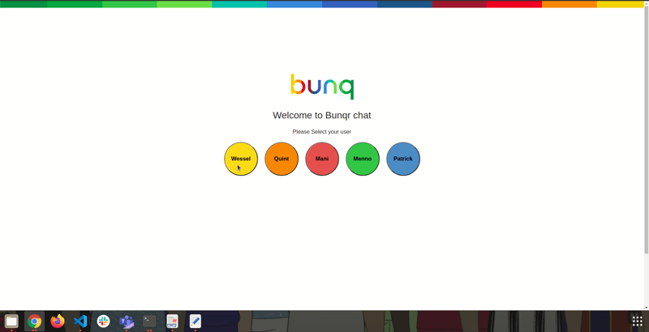

# Bunqr Chat 

# 

## About
A chat application that uses backend api provided by Bunq for an internal chat-based conversation among users.

### Features
1. Login using given users
2. Create a personal chat
3. Create a group chat
4. Loading more messages in a conversation
5. Polling new messages in a conversation
6. Loading more conversations
7. Get conversation details
8. Logging out of the current user to login as another user

This project was bootstrapped with [Create React App](https://github.com/facebook/create-react-app).

## Available Scripts

In the project directory, you can run:
### `npm install`

Installs the application dependencies

### `npm start`

Runs the app in the development mode. 
Open [http://localhost:3000](http://localhost:3000) to view it in the browser.

### `npm run build`

Builds the app for production to the `build` folder. 
It correctly bundles React in production mode and optimizes the build for the best performance.

The build is minified and the filenames include the hashes. 
Your app is ready to be deployed!

See the section about [deployment](https://facebook.github.io/create-react-app/docs/deployment) for more information.

